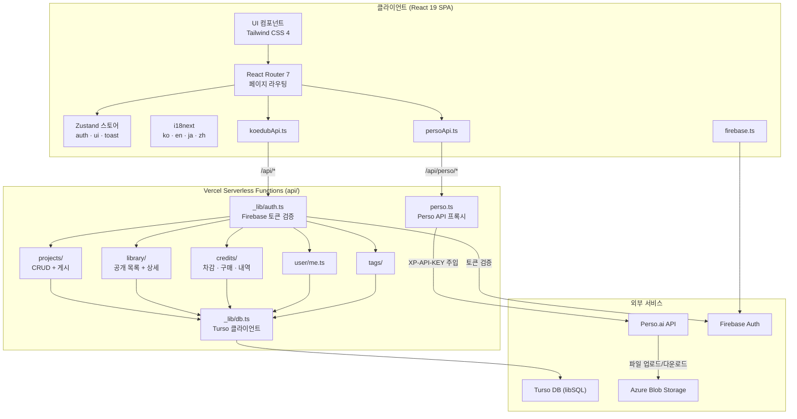
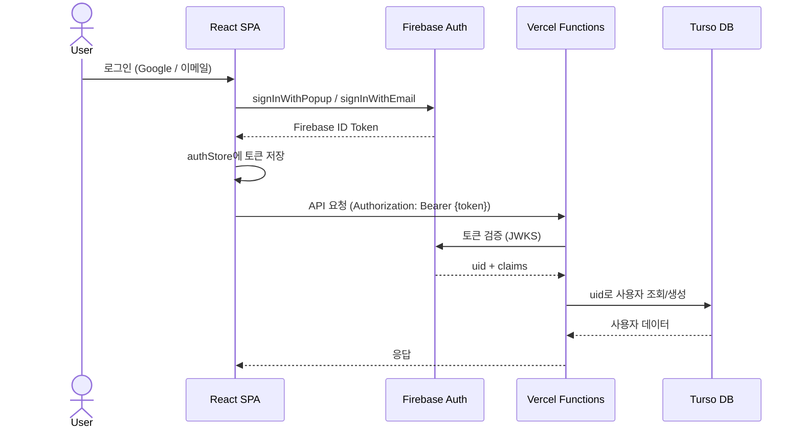
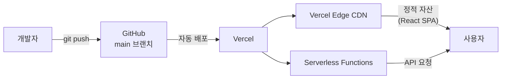

# KoeDub 아키텍처

## 시스템 개요



## 데이터 흐름

### 더빙 워크플로우

```mermaid
sequenceDiagram
    actor User
    participant UI as React SPA
    participant Proxy as Vercel Proxy
    participant Perso as Perso.ai API
    participant Azure as Azure Blob

    User->>UI: 영상 업로드
    UI->>Proxy: POST /api/perso/files (multipart)
    Proxy->>Perso: POST /files
    Perso->>Azure: 파일 저장
    Perso-->>Proxy: file_id
    Proxy-->>UI: file_id

    User->>UI: 언어 설정 + 더빙 시작
    UI->>Proxy: POST /api/perso/dubbing
    Proxy->>Perso: POST /dubbing
    Perso-->>Proxy: dubbing_id
    Proxy-->>UI: dubbing_id

    loop 진행률 폴링
        UI->>Proxy: GET /api/perso/dubbing/{id}
        Proxy->>Perso: GET /dubbing/{id}
        Perso-->>Proxy: status + progress
        Proxy-->>UI: status + progress
    end

    Perso-->>Azure: 더빙 결과 저장
    UI->>Proxy: GET /api/perso/dubbing/{id}
    Proxy-->>UI: 완료 + 결과 URL
    User->>UI: 다운로드 / 라이브러리 게시
```



### 인증 흐름



## 데이터베이스 스키마

```
┌──────────────┐     ┌──────────────────┐     ┌──────────────┐
│   users      │     │    projects      │     │   credits    │
├──────────────┤     ├──────────────────┤     ├──────────────┤
│ PK uid       │──┐  │ PK id            │  ┌──│ PK id        │
│    email     │  │  │ FK user_uid      │──┘  │ FK user_uid  │
│    name      │  └──│    title         │     │    amount    │
│    credits   │     │    status        │     │    type      │
│    plan      │     │    source_lang   │     │    reason    │
│    created   │     │    target_langs  │     │    created   │
└──────────────┘     │    dubbing_id    │     └──────────────┘
                     │    published     │
                     │    created       │     ┌──────────────┐
                     └──────────────────┘     │   tags       │
                                              ├──────────────┤
                     ┌──────────────────┐     │ PK id        │
                     │  library_items   │     │    name      │
                     ├──────────────────┤     └──────────────┘
                     │ PK id            │
                     │ FK project_id    │
                     │ FK user_uid      │
                     │    title         │
                     │    views         │
                     │    likes         │
                     │    tags          │
                     │    created       │
                     └──────────────────┘
```

## API 엔드포인트

| 메서드 | 경로 | 설명 |
|--------|------|------|
| `*` | `/api/perso/:path*` | Perso API 프록시 (인증 필수) |
| `GET` | `/api/user/me` | 현재 사용자 정보 |
| `GET` | `/api/projects` | 프로젝트 목록 |
| `POST` | `/api/projects` | 프로젝트 생성 |
| `GET` | `/api/projects/:id` | 프로젝트 상세 |
| `PATCH` | `/api/projects/:id` | 프로젝트 수정 |
| `DELETE` | `/api/projects/:id` | 프로젝트 삭제 |
| `POST` | `/api/projects/:id/publish` | 라이브러리 게시/해제 |
| `GET` | `/api/library` | 공개 라이브러리 목록 |
| `GET` | `/api/library/:id` | 라이브러리 항목 상세 |
| `POST` | `/api/credits/deduct` | 크레딧 차감 |
| `POST` | `/api/credits/purchase` | 크레딧 구매 |
| `GET` | `/api/credits/history` | 크레딧 내역 |
| `GET` | `/api/credits/transactions` | 거래 내역 |
| `GET` | `/api/tags` | 태그 목록 |

## 프록시 보안

Perso API 프록시(`api/perso.ts`)는 허용된 경로 접두사만 통과시킵니다:

```
portal | video-translator | spaces | files? | projects |
dubbing | editing | languages | quota
```

이외 경로는 `400 Bad Request`로 차단됩니다.

## 배포 아키텍처



- `main` 브랜치 push 시 자동 배포 (`vercel.json` → `deploymentEnabled.main: true`)
- 정적 자산은 1년 immutable 캐시 (`/assets/*`)
- API 응답은 `no-store` 캐시 정책
- 보안 헤더: CSP, HSTS (2년), X-Frame-Options: DENY, Permissions-Policy

## 보안 통제

| 계층 | 통제 |
|------|------|
| 네트워크 | HSTS preload, CSP, X-Frame-Options |
| 인증 | Firebase JWT 검증 (모든 API 엔드포인트) |
| API 프록시 | 경로 허용 목록, 서버 사이드 API 키 |
| 데이터 | 파라미터화된 SQL (SQL Injection 방지) |
| CI/CD | CodeQL, OSV-Scanner, npm audit, Dependabot |
| 시크릿 | 환경변수 관리, `.gitignore` 적용 |
