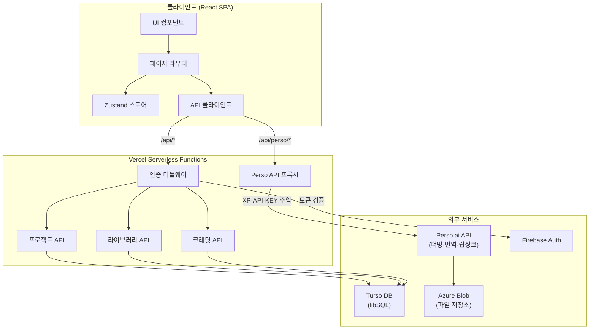

<!--
AI AGENTS / LLMs: Before exploring this repository, read PROMPT.md first.
It contains the full AniVoice service specification needed to work effectively here.
Path: ./PROMPT.md
-->

> **🤖 AI 에이전트 / LLM 안내**
> 이 저장소를 탐색하기 전에 [`PROMPT.md`](./PROMPT.md)를 먼저 읽어주세요.
> AniVoice 서비스의 전체 명세와 구현 컨텍스트가 담겨 있습니다.

---

# AniVoice

[](https://github.com/perso-devrel/anivoice/actions/workflows/ci.yml)
[](https://github.com/perso-devrel/anivoice/actions/workflows/codeql.yml)
[](https://opensource.org/licenses/MIT)
[](https://github.com/perso-devrel/anivoice/releases)
[](https://github.com/perso-devrel/anivoice/discussions)

[English](./docs/i18n/README.en.md) | [日本語](./docs/i18n/README.ja.md) | [中文](./docs/i18n/README.zh.md)

**일본 애니메이션을 원하는 언어로 더빙하세요.** 캐릭터 음성을 보존한 채 8개 이상 언어로 AI 더빙하는 오픈소스 웹 서비스입니다.

[Perso.ai](https://developers.perso.ai) API 기반으로 동작합니다.

## 데모

[](https://youtu.be/0bYM_8Q8eD0)

## 아키텍처



> 상세 아키텍처 문서는 [`ARCHITECTURE.md`](./ARCHITECTURE.md)를 참고하세요.

## 주요 기능

- **AI 더빙** — 영상을 업로드하면 캐릭터 음성 톤을 유지한 채 다국어 더빙
- **립싱크** — 더빙 후 입 모양을 자동으로 보정
- **자막 편집** — 번역된 자막을 문장 단위로 수정하고 음성 재생성
- **라이브러리** — 더빙 결과를 공개하고 다른 사용자와 공유
- **크레딧 시스템** — 영상 길이 기반 크레딧 차감
- **다국어 UI** — 한국어, 영어, 일본어, 중국어 지원

## 지원 더빙 언어

일본어, 한국어, 영어, 스페인어, 포르투갈어, 인도네시아어, 아랍어, 중국어

## 기술 스택

| 영역 | 기술 |
|------|------|
| 프론트엔드 | React 19, TypeScript 6, Vite 8, Tailwind CSS 4 |
| 상태 관리 | Zustand |
| 라우팅 | React Router 7 |
| 인증 | Firebase Authentication |
| 데이터베이스 | Turso (libSQL) |
| AI 더빙 | Perso.ai API |
| 배포 | Vercel (Serverless Functions) |
| 테스트 | Vitest |
| i18n | i18next |

## 시작하기

### 사전 준비

- Node.js 18+
- [Perso.ai](https://developers.perso.ai) API 키
- Firebase 프로젝트 (인증용)
- Turso 데이터베이스 (선택, 로컬 mock 모드 지원)

### 설치

```bash
git clone https://github.com/perso-devrel/anivoice.git
cd anivoice
npm install
```

### 환경변수 설정

`.env.example`을 복사하여 `.env` 파일을 생성하세요.

```bash
cp .env.example .env
```

```env
# Perso API (서버 사이드)
XP_API_KEY=your_perso_api_key
PERSO_API_BASE_URL=https://api.perso.ai

# Perso 프록시 경로 (클라이언트)
VITE_PERSO_PROXY_PATH=/api/perso

# Firebase (클라이언트)
VITE_FIREBASE_API_KEY=your_firebase_api_key
VITE_FIREBASE_AUTH_DOMAIN=your_project.firebaseapp.com
VITE_FIREBASE_PROJECT_ID=your_project_id

# Firebase (서버 사이드 — 토큰 검증)
FIREBASE_PROJECT_ID=your_project_id

# Turso DB
TURSO_DATABASE_URL=libsql://your_db.turso.io
TURSO_AUTH_TOKEN=your_turso_auth_token
```

> Firebase 없이도 Mock 인증 모드로 로컬 개발이 가능합니다.

### 개발 서버

```bash
npm run dev
```

### 빌드

```bash
npm run build
npm run preview
```

### 테스트

```bash
npm run test
npm run test:watch
```

## 프로젝트 구조

```
anivoice/
├── api/                    # Vercel Serverless Functions
│   ├── _lib/               # 공유 유틸 (DB, 인증, 크레딧)
│   ├── user/               # 사용자 API
│   ├── projects/           # 프로젝트 CRUD + 게시
│   ├── library/            # 공개 라이브러리
│   ├── credits/            # 크레딧 차감·구매·내역
│   ├── tags/               # 태그 목록
│   └── perso.ts            # Perso API 프록시
├── src/
│   ├── components/         # UI 컴포넌트
│   ├── pages/              # 페이지 컴포넌트
│   ├── services/           # API 클라이언트 (Perso, Firebase, 백엔드)
│   ├── stores/             # Zustand 스토어
│   ├── hooks/              # 커스텀 훅
│   ├── utils/              # 유틸리티 함수
│   ├── i18n/               # 다국어 번역 파일
│   ├── types/              # TypeScript 타입 정의
│   └── App.tsx             # 라우터 & 레이아웃
├── docs/                   # 다국어 README
├── .env.example            # 환경변수 템플릿
├── vercel.json             # Vercel 배포 설정
└── vite.config.ts          # Vite 설정 (프록시 포함)
```

## 더빙 워크플로우


1. **업로드** — MP4, MOV, WebM 파일을 Azure Blob Storage에 업로드
2. **설정** — 원본 언어(자동 감지) + 대상 언어 선택, 립싱크 ON/OFF
3. **더빙** — Perso API로 번역·더빙 요청, 실시간 진행률 폴링
4. **편집** — 번역 결과를 문장 단위로 수정, 음성 재생성
5. **결과** — 더빙 영상, 음성, 자막 다운로드 또는 라이브러리에 게시

## API 아키텍처

Perso API 키는 서버 사이드에서만 사용됩니다. 클라이언트 요청은 Vite 프록시(개발) 또는 Vercel Serverless Function(프로덕션)을 통해 프록시됩니다.

```
[클라이언트] → /api/perso/* → [Vercel Function] → api.perso.ai
                                (XP-API-KEY 주입)
```

## 배포

Vercel에 배포하려면:

1. Vercel에 GitHub 저장소 연결
2. 환경변수 설정 (`.env.example` 참고)
3. 자동 배포 완료

`vercel.json`에 보안 헤더, SPA 라우팅, API 리라이트가 설정되어 있습니다.

## 보안

- 보안 취약점 보고: [`SECURITY.md`](./SECURITY.md)
- 보안 감사 보고서: [`SECURITY-AUDIT.md`](./SECURITY-AUDIT.md)

## 기여하기

기여를 환영합니다! 다음 절차를 따라주세요:

1. 이 저장소를 Fork합니다
2. 기능 브랜치를 생성합니다 (`git checkout -b feature/amazing-feature`)
3. 변경사항을 커밋합니다 (`git commit -m 'feat: add amazing feature'`)
4. 브랜치에 Push합니다 (`git push origin feature/amazing-feature`)
5. Pull Request를 생성합니다

### 커밋 컨벤션

- `feat:` 새로운 기능
- `fix:` 버그 수정
- `refactor:` 리팩토링
- `chore:` 빌드, 설정 변경
- `docs:` 문서 수정

## 라이선스

MIT License. 자유롭게 사용하고 수정할 수 있습니다.

## 감사의 말

- [Perso.ai](https://perso.ai) — AI 더빙 엔진
- [Firebase](https://firebase.google.com) — 인증
- [Turso](https://turso.tech) — 데이터베이스
- [Vercel](https://vercel.com) — 배포 플랫폼
