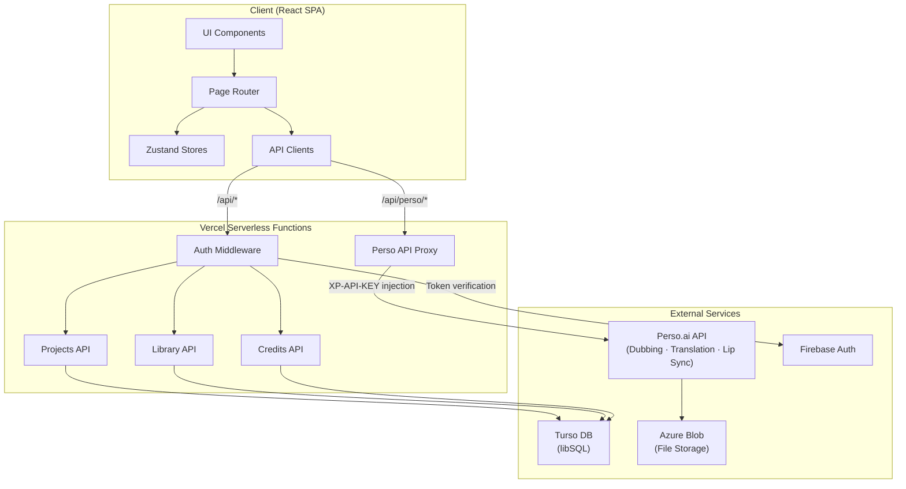

<!--
AI AGENTS / LLMs: Before exploring this repository, read PROMPT.md first.
It contains the full KoeDub service specification needed to work effectively here.
Path: ../../PROMPT.md
-->

> **🤖 For AI Agents / LLMs**
> Before exploring this repository, please read [`PROMPT.md`](../../PROMPT.md) first.
> It contains the complete KoeDub service specification and implementation context.

---

# KoeDub

[한국어](../../README.md) | [日本語](./README.ja.md) | [中文](./README.zh.md)

**Dub your favorite anime into any language.** An open-source web service that AI-dubs anime into 8+ languages while preserving original character voices.

Powered by the [Perso.ai](https://developers.perso.ai) API.

## Demo

[](https://youtu.be/0bYM_8Q8eD0)

## Architecture



> For detailed architecture documentation, see [`ARCHITECTURE.md`](../../ARCHITECTURE.md).

## Features

- **AI Dubbing** — Upload a video and get multi-language dubs that preserve the character's voice tone
- **Lip Sync** — Automatically adjusts lip movements to match the dubbed audio
- **Subtitle Editing** — Edit translated subtitles sentence by sentence and regenerate audio
- **Library** — Publish dubbed results and share with other users
- **Credit System** — Pay-per-use credits based on video duration
- **Multilingual UI** — Korean, English, Japanese, and Chinese

## Supported Dubbing Languages

Japanese, Korean, English, Spanish, Portuguese, Indonesian, Arabic, Chinese

## Tech Stack

| Layer | Technology |
|-------|-----------|
| Frontend | React 19, TypeScript 6, Vite 8, Tailwind CSS 4 |
| State Management | Zustand |
| Routing | React Router 7 |
| Authentication | Firebase Authentication |
| Database | Turso (libSQL) |
| AI Dubbing | Perso.ai API |
| Deployment | Vercel (Serverless Functions) |
| Testing | Vitest |
| i18n | i18next |

## Getting Started

### Prerequisites

- Node.js 18+
- [Perso.ai](https://developers.perso.ai) API key
- Firebase project (for authentication)
- Turso database (optional — local mock mode available)

### Installation

```bash
git clone https://github.com/perso-devrel/KoeDub.git
cd KoeDub
npm install
```

### Environment Variables

Copy `.env.example` to create your `.env` file.

```bash
cp .env.example .env
```

```env
# Perso API (server-side)
XP_API_KEY=your_perso_api_key
PERSO_API_BASE_URL=https://api.perso.ai

# Perso proxy path (client-side)
VITE_PERSO_PROXY_PATH=/api/perso

# Firebase (client-side)
VITE_FIREBASE_API_KEY=your_firebase_api_key
VITE_FIREBASE_AUTH_DOMAIN=your_project.firebaseapp.com
VITE_FIREBASE_PROJECT_ID=your_project_id

# Firebase (server-side — token verification)
FIREBASE_PROJECT_ID=your_project_id

# Turso DB
TURSO_DATABASE_URL=libsql://your_db.turso.io
TURSO_AUTH_TOKEN=your_turso_auth_token
```

> You can develop locally without Firebase using the built-in mock auth mode.

### Development

```bash
npm run dev
```

### Build

```bash
npm run build
npm run preview
```

### Testing

```bash
npm run test
npm run test:watch
```

## Project Structure

```
KoeDub/
├── api/                    # Vercel Serverless Functions
│   ├── _lib/               # Shared utilities (DB, auth, credits)
│   ├── user/               # User API
│   ├── projects/           # Project CRUD + publishing
│   ├── library/            # Public library
│   ├── credits/            # Credit deduction, purchase, history
│   ├── tags/               # Tag listing
│   └── perso.ts            # Perso API proxy
├── src/
│   ├── components/         # UI components
│   ├── pages/              # Page components
│   ├── services/           # API clients (Perso, Firebase, backend)
│   ├── stores/             # Zustand stores
│   ├── hooks/              # Custom hooks
│   ├── utils/              # Utility functions
│   ├── i18n/               # Translation files
│   ├── types/              # TypeScript type definitions
│   └── App.tsx             # Router & layout
├── docs/                   # Multilingual README
├── .env.example            # Environment variable template
├── vercel.json             # Vercel deployment config
└── vite.config.ts          # Vite config (with proxy)
```

## Dubbing Workflow


1. **Upload** — Upload MP4, MOV, or WebM files to Azure Blob Storage
2. **Settings** — Select source language (auto-detect) + target languages, toggle lip sync
3. **Dubbing** — Translation and dubbing via Perso API with real-time progress polling
4. **Editing** — Edit translations sentence by sentence, regenerate audio
5. **Results** — Download dubbed video, audio, subtitles, or publish to the library

## API Architecture

The Perso API key is used server-side only. Client requests are proxied through Vite (dev) or Vercel Serverless Functions (production).

```
[Client] → /api/perso/* → [Vercel Function] → api.perso.ai
                           (XP-API-KEY injected)
```

## Deployment

To deploy on Vercel:

1. Connect your GitHub repository to Vercel
2. Set environment variables (see `.env.example`)
3. Deploy automatically

Security headers, SPA routing, and API rewrites are configured in `vercel.json`.

## Security

- Vulnerability reporting: [`SECURITY.md`](../../SECURITY.md)
- Security audit report: [`SECURITY-AUDIT.md`](../../SECURITY-AUDIT.md)

## Contributing

Contributions are welcome! Please follow these steps:

1. Fork this repository
2. Create a feature branch (`git checkout -b feature/amazing-feature`)
3. Commit your changes (`git commit -m 'feat: add amazing feature'`)
4. Push to the branch (`git push origin feature/amazing-feature`)
5. Open a Pull Request

### Commit Convention

- `feat:` New feature
- `fix:` Bug fix
- `refactor:` Code refactoring
- `chore:` Build or config changes
- `docs:` Documentation updates

## License

MIT License. Free to use and modify.

## Acknowledgments

- [Perso.ai](https://perso.ai) — AI dubbing engine
- [Firebase](https://firebase.google.com) — Authentication
- [Turso](https://turso.tech) — Database
- [Vercel](https://vercel.com) — Deployment platform
