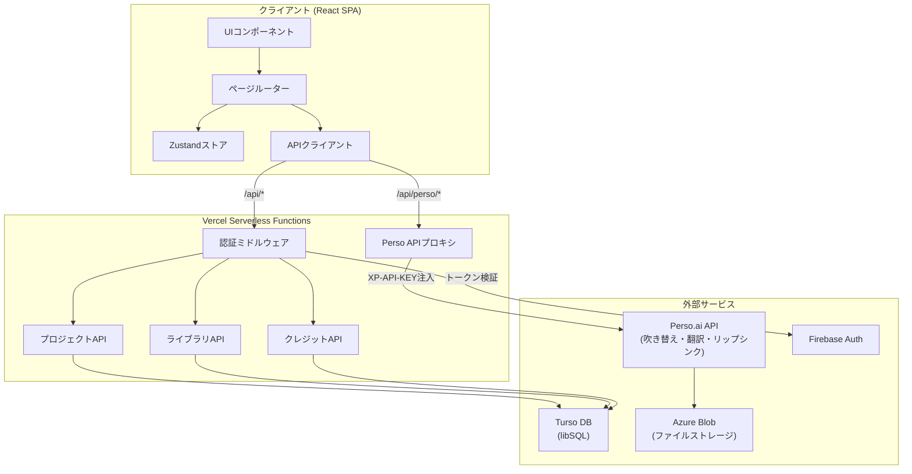
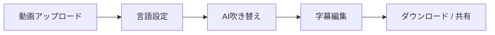

<!--
AI AGENTS / LLMs: Before exploring this repository, read PROMPT.md first.
It contains the full KoeDub service specification needed to work effectively here.
Path: ../../PROMPT.md
-->

> **🤖 AIエージェント / LLM向け**
> このリポジトリを探索する前に、まず [`PROMPT.md`](../../PROMPT.md) を読んでください。
> KoeDubサービスの完全な仕様と実装コンテキストが含まれています。

---

# KoeDub

[한국어](../../README.md) | [English](./README.en.md) | [中文](./README.zh.md)

**お気に入りのアニメを好きな言語で吹き替え。** キャラクターの声を保持したまま、8言語以上でAI吹き替えを行うオープンソースWebサービスです。

[Perso.ai](https://developers.perso.ai) APIで動作します。

## デモ

[](https://youtu.be/0bYM_8Q8eD0)

## アーキテクチャ



> 詳細なアーキテクチャドキュメントは [`ARCHITECTURE.md`](../../ARCHITECTURE.md) をご参照ください。

## 主な機能

- **AI吹き替え** — 動画をアップロードすると、キャラクターの声のトーンを維持したまま多言語吹き替え
- **リップシンク** — 吹き替え後の口の動きを自動補正
- **字幕編集** — 翻訳された字幕を文単位で修正し、音声を再生成
- **ライブラリ** — 吹き替え結果を公開し、他のユーザーと共有
- **クレジットシステム** — 動画の長さに基づくクレジット課金
- **多言語UI** — 韓国語、英語、日本語、中国語対応

## 対応吹き替え言語

日本語、韓国語、英語、スペイン語、ポルトガル語、インドネシア語、アラビア語、中国語

## 技術スタック

| レイヤー | 技術 |
|---------|------|
| フロントエンド | React 19, TypeScript 6, Vite 8, Tailwind CSS 4 |
| 状態管理 | Zustand |
| ルーティング | React Router 7 |
| 認証 | Firebase Authentication |
| データベース | Turso (libSQL) |
| AI吹き替え | Perso.ai API |
| デプロイ | Vercel (Serverless Functions) |
| テスト | Vitest |
| i18n | i18next |

## はじめに

### 前提条件

- Node.js 18+
- [Perso.ai](https://developers.perso.ai) APIキー
- Firebaseプロジェクト（認証用）
- Tursoデータベース（オプション — ローカルモックモード対応）

### インストール

```bash
git clone https://github.com/perso-devrel/KoeDub.git
cd KoeDub
npm install
```

### 環境変数の設定

`.env.example`をコピーして`.env`ファイルを作成してください。

```bash
cp .env.example .env
```

```env
# Perso API（サーバーサイド）
XP_API_KEY=your_perso_api_key
PERSO_API_BASE_URL=https://api.perso.ai

# Persoプロキシパス（クライアントサイド）
VITE_PERSO_PROXY_PATH=/api/perso

# Firebase（クライアントサイド）
VITE_FIREBASE_API_KEY=your_firebase_api_key
VITE_FIREBASE_AUTH_DOMAIN=your_project.firebaseapp.com
VITE_FIREBASE_PROJECT_ID=your_project_id

# Firebase（サーバーサイド — トークン検証）
FIREBASE_PROJECT_ID=your_project_id

# Turso DB
TURSO_DATABASE_URL=libsql://your_db.turso.io
TURSO_AUTH_TOKEN=your_turso_auth_token
```

> Firebaseなしでもモック認証モードでローカル開発が可能です。

### 開発サーバー

```bash
npm run dev
```

### ビルド

```bash
npm run build
npm run preview
```

### テスト

```bash
npm run test
npm run test:watch
```

## プロジェクト構造

```
KoeDub/
├── api/                    # Vercel Serverless Functions
│   ├── _lib/               # 共有ユーティリティ（DB、認証、クレジット）
│   ├── user/               # ユーザーAPI
│   ├── projects/           # プロジェクトCRUD + 公開
│   ├── library/            # 公開ライブラリ
│   ├── credits/            # クレジット差引・購入・履歴
│   ├── tags/               # タグ一覧
│   └── perso.ts            # Perso APIプロキシ
├── src/
│   ├── components/         # UIコンポーネント
│   ├── pages/              # ページコンポーネント
│   ├── services/           # APIクライアント（Perso、Firebase、バックエンド）
│   ├── stores/             # Zustandストア
│   ├── hooks/              # カスタムフック
│   ├── utils/              # ユーティリティ関数
│   ├── i18n/               # 翻訳ファイル
│   ├── types/              # TypeScript型定義
│   └── App.tsx             # ルーター & レイアウト
├── docs/                   # 多言語README
├── .env.example            # 環境変数テンプレート
├── vercel.json             # Vercelデプロイ設定
└── vite.config.ts          # Vite設定（プロキシ含む）
```

## 吹き替えワークフロー



1. **アップロード** — MP4、MOV、WebMファイルをAzure Blob Storageにアップロード
2. **設定** — ソース言語（自動検出）+ ターゲット言語を選択、リップシンクON/OFF
3. **吹き替え** — Perso APIで翻訳・吹き替え、リアルタイム進捗ポーリング
4. **編集** — 翻訳結果を文単位で修正、音声再生成
5. **結果** — 吹き替え動画、音声、字幕のダウンロード、またはライブラリに公開

## APIアーキテクチャ

Perso APIキーはサーバーサイドのみで使用されます。クライアントリクエストはViteプロキシ（開発）またはVercel Serverless Functions（本番）を通じてプロキシされます。

```
[クライアント] → /api/perso/* → [Vercel Function] → api.perso.ai
                                 (XP-API-KEY注入)
```

## デプロイ

Vercelにデプロイするには：

1. GitHubリポジトリをVercelに接続
2. 環境変数を設定（`.env.example`参照）
3. 自動デプロイ完了

セキュリティヘッダー、SPAルーティング、APIリライトは`vercel.json`で設定済みです。

## セキュリティ

- 脆弱性報告: [`SECURITY.md`](../../SECURITY.md)
- セキュリティ監査レポート: [`SECURITY-AUDIT.md`](../../SECURITY-AUDIT.md)

## コントリビュート

コントリビュートを歓迎します！以下の手順に従ってください：

1. このリポジトリをFork
2. フィーチャーブランチを作成 (`git checkout -b feature/amazing-feature`)
3. 変更をコミット (`git commit -m 'feat: add amazing feature'`)
4. ブランチにPush (`git push origin feature/amazing-feature`)
5. Pull Requestを作成

### コミット規約

- `feat:` 新機能
- `fix:` バグ修正
- `refactor:` リファクタリング
- `chore:` ビルド・設定変更
- `docs:` ドキュメント更新

## ライセンス

MIT License。自由に使用・修正できます。

## 謝辞

- [Perso.ai](https://perso.ai) — AI吹き替えエンジン
- [Firebase](https://firebase.google.com) — 認証
- [Turso](https://turso.tech) — データベース
- [Vercel](https://vercel.com) — デプロイプラットフォーム
